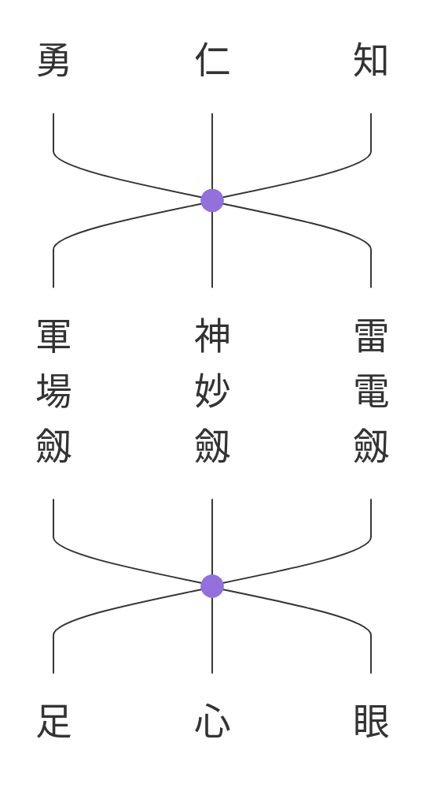

# Scroll of the innermost secrets of iai swordsmanship　居合兵法極意巻

- 日中之事 Concerning sunny days
- 月夜之事 Concerning moonlit nights
- 闇夜之事 Concerning dark nights
- 風吹之事 Concerning times of wind
- 雨中之事 Concerning times of rain
- 雪中之事 Concerning times of snow
- 寒天之事 Concerning cold weather
- 雷電之事 Concerning thunder and lightning
- 相間之事 Concerning distance
- 山坂之事 Concerning slopes and mountains
- 細道之事 Concerning narrow paths
- 絶道之事 Concerning impassable routes
- 大道之事 Concerning wide roads
- 脇道之事 Concerning side paths
- 後用捨之事 Concerning later use and abandonment
- 桝石壇之事 Concerning stone platforms
- 城乗之事 Concerning scaling a castle
- 野町擊之事 Concerning fighting in the fields or in town

---

## Concerning Shinshin Hassō 神心八相之㕝

柄口六寸之㕝 Concerning *tsukaguchi rokusun*

軍場太刀 *Gunba-tachi*

手リケン *Shuriken*

虎亂劍之事 Concerning koran-ken

軍中首取樣之事 On the manner of taking a head in battle

---

---

- 倒臥之事 Concerning falling or lying down
- 中夭之大事 Concerning early death
- 翔通之事 Concerning passing through obstacles
- 多勢一人之㕝 Concerning many against one
- 壹人大勢之事 Concerning one against many
- 二人一人之事 Concerning two against one
- 森林之事 Concerning forests
- 戸壁障子之事 Concerning doors, walls, and sliding screens
- 隔門戸之事 Concerning barred gates and doors

---

介錯口傳

Kaishaku Kuden
Oral Transmission on Kaishaku — the act of the finishing stroke
- 殘極意印可五ヶ條
Zan gokui inka go-ka-jō — Five secret essentials of the final licence

真之仕合前後之㕝 — Makoto no shiai zengo no koto — On true combat, before and after
手離見之事 — Shuriken no koto — On the throwing blade (ken written with 見 as ateji)
手字之㕝 — Teji no koto — On the form or movement of the hand
盲目杖暗夜之事 — Mōmoku-jō anya no koto — On the blind man’s staff in darkness
天眞正靈夢之㕝　附哥三ツ — Tenshin shōrei no yume no koto, fu ka mittsu — On the true spirit’s dream, with three appended poems

△　螺曲尺 — Rakyoku-shaku — The spiral rule
◎　水月一角心 — Suigetsu ikkaku no kokoro — The single-horned heart of water and moon

---

附哥三ツ

Three Appended Poems

水や空　そらやみ津共　見へ分す
通ひてすゝめる　秋の夜の月
止まると思は　そこに　行も思は　とくゝとゆけ
乘得ても　心ゆるすな　海人小船
波間の風の　吹ぬ日もなき

Water and sky—clear and dark straits seen as one;
the autumn moon passes steadily through.
If you think it stops, you err—still it goes;
Even when you have arrived, do not relax your heart,
for the fisherman’s small boat knows no day without wind between the waves.

---

林明神 — Hayashi Myōjin
林崎神助重信 — Hayashizaki Jinsuke Shigenobu
田宮平兵衛尉業正 — Tamiya Heibei no jō Narimasa
長野無樂入道樵露齋 — Nagano Muraku Nyūdō Kinrosai
百々軍兵衛尉光重 — Todo Gunbei no jō Mitsushige

---

（奥書）

Okugaki — Colophon

當流抜刀兵法貴殿多年御執心先師より相傳之巻極意印可等可等
一ヶ條も不殘無相違令授与己得之處肝要之候若懇望之
人於之者兼而誓文御指南尤可也仍而許授之狀如件

Translation:
To you, who for many years have earnestly devoted yourself to this school’s art of sword-drawing, the scrolls and inner teachings of transmission are hereby granted in full, without omission or error. Having attained these teachings, henceforth devote yourself wholeheartedly to their cultivation. Should any person in future sincerely request instruction, you may first require a written pledge and, when appropriate, provide guidance. Accordingly, this catalogue and licence are granted as stated.

慶應四戊辰年　正月吉日
An auspicious day in the first month of Keiō 4 (1868)

嶋村善馬殿 — To Shimamura Zenba-dono

林六太夫守政 — Hayashi Rokudayū Morimasa
林安太夫政誠 — Hayashi Andayū Masanari
大黒元右衛門清勝 — Ōguro Gen’emon Kiyokatsu
松吉貞助久盛 — Matsuyoshi Teisuke Hisamori
山川久藏幸雅 — Yamakawa Kyūzō Yukimasa

下村茂市　印 — Shimomura Shigeichi (seal)
